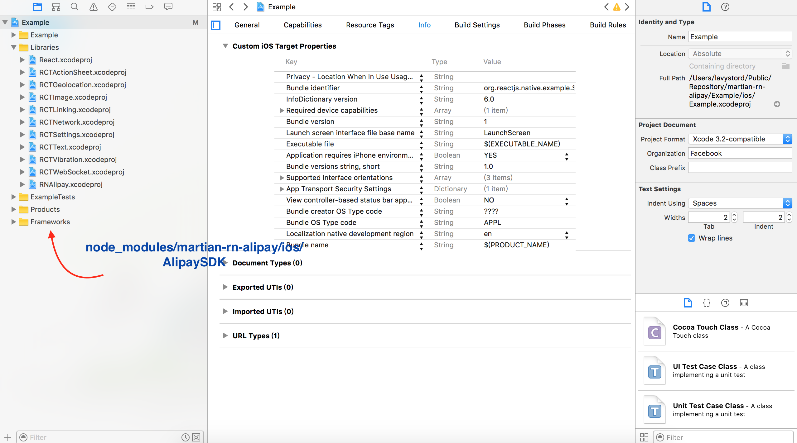
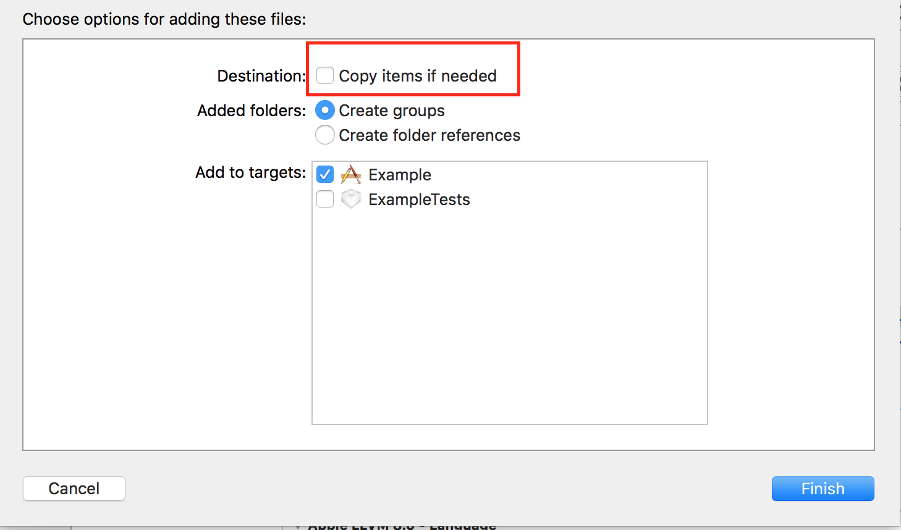
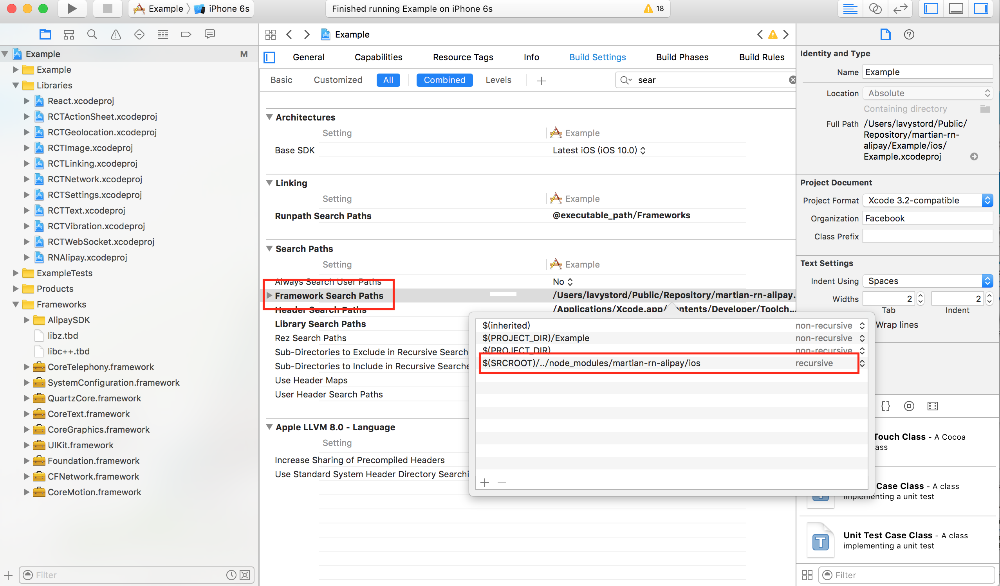

# martian-rn-alipay
react-native 支付宝手机支付模块（杭州码天科技有限公司）
## Installation
1. add `"martian-rn-alipay": "XuChangZJU/martian-domain#dev"`to your `package.json`
2. run `npm install martian-rn-alipay`
3. run `react-native link`

Now, Android is ready and iOS still need some manual configuration.

###iOS Configuration
1. Open your app's Xcode project
2. Drag folder `AlipaySDK` from `node_modules/martian-rn-alipay` into `Frameworks` node in Xcode.  
3. In the dialogue,make sure `Copy items if need` is **NOT** sticked 
4. Under the "Build Settings" tab of your project configuration, find the "Framework Search Paths" section and edit the value.
Add a new value, `$(SRCROOT)/../node_modules/martian-rn-alipay/ios` and select `recursive` in the dropdown.

It's over

###Usage
see Example

 1. make sure the url in `testPay.js` is your ip
 2. `npm run startServer`
 3. `npm start`  
Enjoy it 😜

## Referrence
* [huangzuizui](https://github.com/huangzuizui/rn-alipay)

